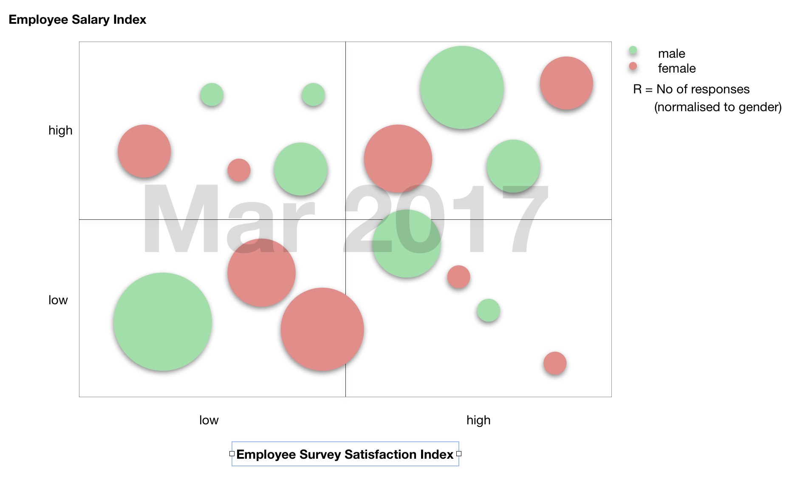

## A general view on charts
2-dimensional charts can visualize up to 3 values and a potentially unlimited number of categories.

_Note: a value series is an array of real numbers, dense and non-enumerable, whereas a category is a (finite) set of enumerable items and can be mapped 1:1 to (a range of) integers._

An example of a complex chart would be:
- Value 1 on a horizontal axis
- Value 2 on a vertical axis
- Value 3 as a measure of the radius of the data point's symbol  (usually a circle, but could be a symbol thats sizes scale with the radius of a circle a that point)
- Category 1..N color code for a data point (explained by a legend)
- Category N+1 as animated selector (most reasonable for time like categories, e.g. month or year)

Real life example: Let's say we have a data set from a user survey that contains data records of the following type:

`{score: 20, salary: 100, gender: male, retention: 20, month: 3}`

We want to draw a portfolio chart, which looks like this:
- dimension _employee satisfaction score_ (value 1): horizontal value axis
- dimension _employee salary_ (value 2): vertical value axis
- dimension _number of survey returns_ (value 3): radius of a data point
- dimension _gender_ (categories 'male', 'female'): color coded
- dimension _survey month_ (categories 'jan', 'feb', ...): animated filter

_The picture above shows a possible representation of the values. The category axis (survey month) is shown in the background. It is taken from a chart representation a.k.a "motion chart", which is used by Hans Rosling. However other options are possible, like showing in the legend or underneath a slider._

<!-- Describing more complex charts implies more complex data series description. -->
#### Category and value axes
In general there is not so much of a difference between the 2 axes types. Actually a category is mostly achieved by mapping function from real type values to integer type values, which is mathematically achieved by a step function like e.g. floor(x). Each value x is uniquely projected onto an integer value, i.e. for each value x there is exactly 1 integer value, which is derived from it.
If categories are derived in such a way from real values, we are creating bands of values. The most common use case, e.g. are histograms, where we calculate bins or bands accumulate all values that fall into that band.
In many, if not most of the cases, the categories are already given and represented by names (e.g. month names, color names, etc.). In those cases we need to map these names onto numerical values, if we want to plot them.

 ### Requirements
 A chart library API should not force the user to re-map data series for each and every chart. Instead a general chart template (or class) should be available that is capable to describe complex and simple charts the same way.

 ### Data representation and renders

 ### Data representation

 #### Category representation

 #### Value representation

 ### Rendering

 ##### Item renderers

 #### Bars and Columns

 #### Lines

 #### Bubbles, Scatter plots

 #### Lolipops / Candle sticks

 #### Animation

 ##### Motion chart, traces, etc.

 #### Symbols

 ## Interacting with charts

 ### Data interactions

 ### Legend interactions

## Responsiveness
We call a UI element to "responsive", if it reacts in certain ways to resizing events of it's container. If the chart's parent container is being resized, several UI elements of the chart may respond in different ways. As a general rule: the smaller the chart, the less is the information density. This could also require a change in the level of detail while resizing, e.g. going from monthly figures to quarterly figures and vice versa.

### Labels (axis and data labels)
If a chart gets resized, it might need to reduce its label information. Most likely the axis' tick labels must be shortened or reduced. This can be achieved by an algorithm like _if the width of a label is greater than the corresponding bandwidth, truncate label to N characters and add ellipsis (...). If label width is still to big, then reduce N until N=1._ However this algorithm could lead to inconsistent axis labelling, such as one label being truncated to 2 while the rest is truncated to 3 characters. This is because different characters take different space. A user option `enforce consistent label length` would ensure that all labels are truncated to the minimum of all. Also there should be an options user function to decide how the label should look like, if certain thresholds are reached. 
Alternatively (as a selectable by option) every second, third, etc. label can be dropped. Also an inset of the plot area can be enforced in order make 2 lines of room for label. This way, every second label can be drawn in the second line. There should also be a delegate pattern to give the user control of what should be applied at best or maybe even implement his own algorithm.

### Grid lines
Grid lines as well as tick marks, if visible, must be considered to be redrawn when labels change. For example if several labels are dropped the user may (or may not) wish to have the according gridlines dropped as well, thus reducing the overall density of the chart.

### Bands
The number of bands of category axes could also be an option to be recalculated, when the bandwidth gets too small. As this requires re-calculation of the data (aggregation/disaggration), it should not be done by the library. Instead, a user function should give the answer.

## Small multiples
https://help.xlcubed.com/Small_Multiple_Videos
